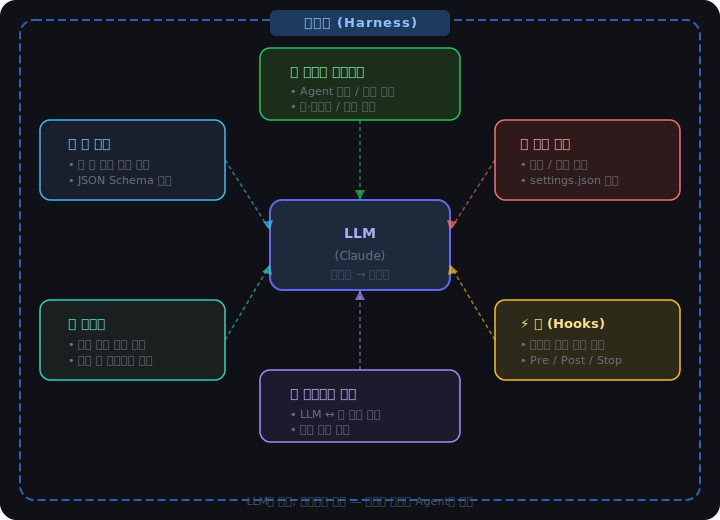
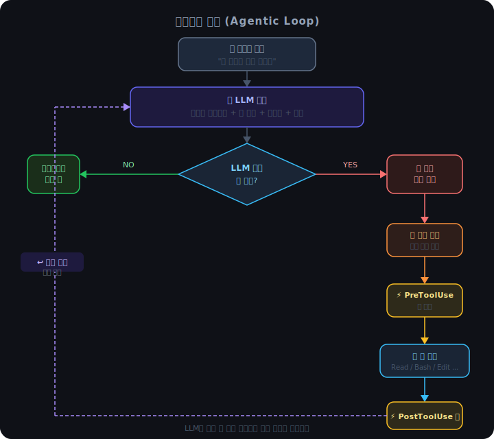

# 하네스(Harness)란 무엇인가

## 한 줄 정의

> 하네스는 **LLM을 Agent로 만들어주는 실행 환경**이다.

LLM 자체는 텍스트를 입력받아 텍스트를 출력하는 모델일 뿐이다.  
하네스가 LLM 주변을 감싸서 도구를 붙이고, 루프를 돌리고, 기억을 관리하고, 권한을 통제한다.

---

## 하네스의 구성 요소



---

## 1. 시스템 프롬프트 (System Prompt)

Agent가 어떻게 행동해야 하는지 정의하는 지시문이다.

사용자 눈에는 보이지 않지만, 모든 대화 전에 LLM에 먼저 전달된다.

**Claude Code의 시스템 프롬프트에 포함된 것들:**

- Agent의 정체성 ("You are Claude Code, Anthropic's official CLI...")
- 행동 원칙 ("보안 취약점을 만들지 마라", "불필요한 추상화를 넣지 마라")
- 톤/스타일 지침 ("응답은 짧고 간결하게", "이모지 쓰지 마라")
- 환경 정보 (OS, 쉘, 현재 날짜, 작업 디렉토리)
- 메모리 내용 (이전 대화에서 저장한 정보)

**왜 중요한가?**  
시스템 프롬프트가 Agent의 "성격"과 "규칙"을 결정한다.  
같은 LLM이라도 시스템 프롬프트가 다르면 완전히 다른 Agent가 된다.

---

## 2. 툴 정의 (Tool Definitions)

LLM에게 "이런 행동을 할 수 있습니다"라고 알려주는 목록이다.

각 툴은 JSON Schema 형태로 정의된다.

```json
{
  "name": "Bash",
  "description": "쉘 명령어를 실행합니다",
  "parameters": {
    "command": {
      "type": "string",
      "description": "실행할 명령어"
    },
    "timeout": {
      "type": "number",
      "description": "제한 시간 (밀리초)"
    }
  }
}
```

LLM은 이 정의를 보고 언제 어떤 툴을 써야 할지 판단한다.  
툴 설명(description)을 잘 쓰는 것이 Agent 성능에 직접 영향을 미친다.

---

## 3. 권한 설정 (Permissions)

Agent가 어떤 행동을 할 수 있는지 허용 범위를 정한다.

Claude Code는 두 가지 설정 파일로 권한을 관리한다.

| 파일 | 위치 | 용도 |
|------|------|------|
| `settings.json` | `~/.claude/` (글로벌) | 모든 프로젝트에 적용 |
| `settings.local.json` | `.claude/` (프로젝트) | 이 프로젝트에만 적용 |

예시:
```json
{
  "permissions": {
    "allow": ["Bash(npm run *)", "Read", "Edit"],
    "deny": ["Bash(rm -rf *)"]
  }
}
```

**권한이 없는 행동을 시도하면?**  
하네스가 LLM의 요청을 가로채고 사용자에게 승인을 요청한다.  
LLM이 직접 실행하는 게 아니라, 하네스가 중간에서 통제한다.

---

## 4. 메모리 (Memory)

Agent가 대화를 넘어서 정보를 기억하게 해주는 시스템.

Claude Code의 메모리는 파일 기반이다.

```
~/.claude/projects/<프로젝트경로>/memory/
├── MEMORY.md        ← 인덱스 (빠른 참조)
├── user_profile.md  ← 사용자 정보
├── feedback_*.md    ← 행동 교정 기록
└── project_*.md     ← 프로젝트 컨텍스트
```

대화가 시작될 때 하네스가 이 파일들을 읽어 시스템 프롬프트에 포함시킨다.  
덕분에 새 대화를 시작해도 이전 맥락을 유지할 수 있다.

---

## 5. 훅 (Hooks)

특정 이벤트가 발생했을 때 자동으로 실행되는 쉘 명령어.

LLM이 아니라 **하네스가 실행**한다는 점이 핵심이다.

```json
{
  "hooks": {
    "PostToolUse": [
      {
        "matcher": "Bash",
        "hooks": [{ "type": "command", "command": "echo '명령 실행됨'" }]
      }
    ],
    "Stop": [
      {
        "hooks": [{ "type": "command", "command": "notify-send '작업 완료'" }]
      }
    ]
  }
}
```

**사용 가능한 훅 이벤트:**

| 이벤트 | 발생 시점 |
|--------|-----------|
| `PreToolUse` | 툴 실행 직전 |
| `PostToolUse` | 툴 실행 직후 |
| `Stop` | Agent가 응답을 마쳤을 때 |
| `Notification` | 사용자 승인이 필요할 때 |

---

## 6. 에이전트 루프 (Agentic Loop)

하네스가 LLM과 툴 사이에서 메시지를 주고받으며 반복하는 구조.



이 루프가 멈추는 조건:
- LLM이 더 이상 툴을 호출하지 않고 텍스트만 반환할 때
- 최대 반복 횟수에 도달했을 때
- 오류가 발생했을 때

---

## 정리: 하네스 없이는 Agent가 없다

| 요소 | 없으면? |
|------|---------|
| 시스템 프롬프트 | LLM이 어떻게 행동할지 모름 |
| 툴 정의 | LLM이 아무것도 "할" 수 없음 |
| 권한 설정 | Agent가 위험한 행동을 할 수 있음 |
| 메모리 | 매번 새로 시작, 문맥 없음 |
| 훅 | 자동화된 사이드 이펙트 불가 |
| 에이전트 루프 | 한 번 답하고 끝 (LLM과 동일) |

> **하네스 = Agent의 뼈대.**  
> LLM은 두뇌, 하네스는 몸통이다.
