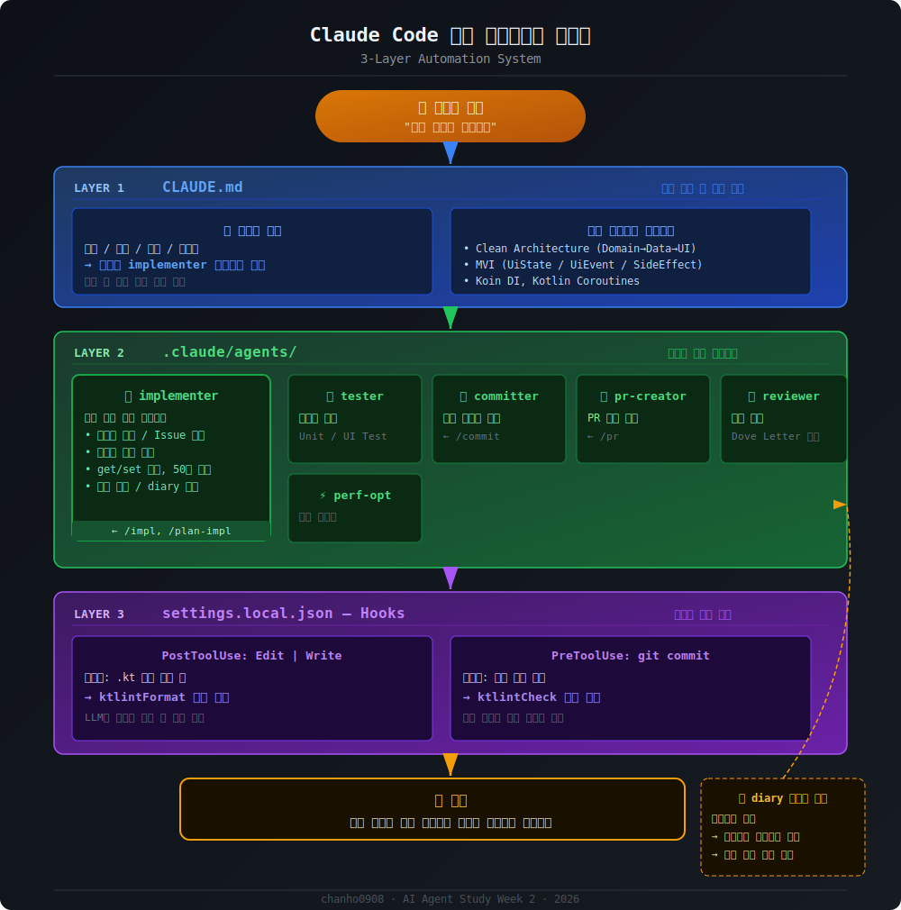

# 실제 프로젝트에 Claude Code 에이전트 시스템 적용기

## 1. 목적 


## 1.1 서브 에이전트 + 슬래시 커맨드

Claude Code는 `.claude/agents/` 디렉토리에 마크다운 파일을 두면 서브에이전트를 정의할 수 있다.

**[`implementer.md`](https://github.com/chanho0908/AI-Agent-Study/blob/main/week2/agents/implementer.md) 작성** : 아키텍처 원칙, 네이밍 컨벤션, 코드 스타일을 전부 정의

## 2. 문제 상황

안드로이드 앱 프로젝트를 Claude Code로 개발하다가 한 가지 문제가 생겼다.

- 에이전트에 **`implementer.md`** 를 만들어 아키텍처 원칙, 네이밍 컨벤션, 코드 스타일을 꼼꼼히 정의했다
- 그런데 간단한 작업(함수 하나 추가 등)을 요청하면 LLM이 자체 판단으로 implementer를 **우회**해서 직접 코드를 작성해버린다
- 결과적으로 내가 정성껏 정의한 컨벤션이 무시된다

**핵심 질문:** LLM이 항상 내가 정의한 에이전트를 통해 코드를 작성하게 강제할 수 있을까?

## 2.1 `/impl` 슬래시 커맨드 작성

매번 에이전트 이름을 입력하기 번거로우니, `.claude/commands/impl.md`로 단축 커맨드를 만들었다.

```markdown
---
description: implementer 에이전트에게 구현을 위임한다
---
$ARGUMENTS 작업을 implementer 에이전트를 사용해서 구현해줘.
```

이제 `/impl 무한 스크롤 추가` 한 줄이면 implementer가 내 컨벤션대로 코드를 짜준다.

---

## 개선 전략: 3-레이어 자동화 시스템

```
사용자 요청
    ↓
[Layer 1] CLAUDE.md — 세션 시작 시 자동 로드, "무조건 implementer 써라" 규칙
    ↓
[Layer 2] .claude/agents/ — 역할별 전문 에이전트
    ↓
[Layer 3] Hooks — 파일 수정 시 자동 포맷/검증
```

---

## Layer 1: CLAUDE.md — 라우팅 규칙

Claude Code는 세션 시작 시 `CLAUDE.md`를 자동으로 읽는다. 여기에 핵심 규칙을 넣었다.

```markdown
## 필수 규칙

모든 코드 구현은 반드시 implementer 서브에이전트를 통해 수행하세요.
직접 코드를 작성하지 마세요.

- 단순 질문이나 설명은 직접 답변 가능
- 코드를 한 줄이라도 작성해야 한다면 → implementer 에이전트
```

**왜 효과적인가?**
- 슬래시 커맨드(`/impl`)는 사용자가 명시적으로 호출해야 함
- CLAUDE.md는 **모든 세션에서 자동 적용** — 사용자가 아무 요청을 해도 LLM이 이 규칙을 먼저 읽고 시작함

---

## Layer 2: .claude/agents/ — 전문 에이전트 분업

```
.claude/
  agents/
    implementer.md       ← 코드 구현 (MVI + Clean Architecture 원칙 포함)
    tester.md            ← 테스트 작성
    committer.md         ← 커밋 메시지 작성 + git 커밋
    pr-creator.md        ← PR 생성 (GitHub)
    performance-optimizer.md  ← 성능 최적화
    doveletter-reviewer.md    ← Android 베스트 프랙티스 코드 리뷰
  commands/
    impl.md              ← /impl 슬래시 커맨드
    plan-impl.md         ← /plan-impl (구현 전 계획 수립)
    commit.md            ← /commit
    pr.md                ← /pr
```

### implementer.md 핵심 내용

implementer는 단순히 "코드 짜주는 AI"가 아니다. 다음이 내장되어 있다:

**아키텍처 강제**
- Clean Architecture 레이어 분리 (Domain → Data → Presentation → UI)
- MVI 패턴 (UiState / UiEvent / SideEffect)

**코드 컨벤션 강제**
- `get`/`set` 접두사 금지 → `fetch`, `load`, `update` 등 사용
- 매직 넘버 상수화 필수
- 클래스 50줄, 메서드 15줄 초과 시 자동 분리
- `else` 금지 → early return 또는 `when`

**작업 프로세스 강제**
1. 현재 브랜치 확인 → `main`/`develop`이면 Issue 생성 + 브랜치 분기
2. 코드 구현
3. ktlint 검증 통과 확인
4. 작업 회고 → 시행착오 있으면 diary 기록

---

## Layer 3: Hooks — 자동 포맷/검증

`settings.local.json`에 정의한 hooks:

```json
{
  "hooks": {
    "PostToolUse": [{
      "matcher": "Edit|Write",
      "hooks": [{
        "type": "command",
        "command": "f=$(jq -r '.tool_input.file_path // empty'); case \"$f\" in *.kt) ./gradlew ktlintFormat ;; esac"
      }]
    }],
    "PreToolUse": [{
      "matcher": "Bash",
      "hooks": [{
        "type": "command",
        "command": "cmd=$(jq -r '.tool_input.command // empty'); case \"$cmd\" in *\"git commit\"*) ./gradlew ktlintCheck ;; esac"
      }]
    }]
  }
}
```

**동작 방식:**
- `.kt` 파일 Edit/Write 시 → `ktlintFormat` 자동 실행 (포맷팅)
- `git commit` 명령 직전 → `ktlintCheck` 자동 실행 (검증)
- 스타일 위반 코드는 커밋 자체가 불가능

---

## 실제 워크플로우

```
나: "PhotoLog 화면에 무한 스크롤 추가해줘"
    ↓
Claude: (CLAUDE.md 읽음) → implementer 에이전트 호출
    ↓
implementer:
  1. git branch 확인 → main이면 GitHub Issue 자동 생성 + feature 브랜치 분기
  2. 기존 코드 파악 (Glob, Read)
  3. Domain → Data → Presentation → UI 순서로 구현
  4. .kt 파일 Edit 시 ktlintFormat 자동 실행 (hook)
  5. 구현 완료 후 회고 → 필요 시 diary 기록
    ↓
나: "/commit" 슬래시 커맨드
    ↓
committer 에이전트:
  - git commit 전 ktlintCheck 자동 실행 (hook)
  - 통과 시 커밋 메시지 작성 + 커밋
    ↓
나: "/pr" 슬래시 커맨드
    ↓
pr-creator 에이전트: GitHub PR 자동 생성
```

---

## 배운 점

### 1. CLAUDE.md가 슬래시 커맨드보다 강력한 이유

슬래시 커맨드는 사용자가 **명시적으로 호출**해야 동작한다. 그런데 CLAUDE.md는 **모든 세션에서 자동 로드**된다. LLM이 가장 먼저 읽는 컨텍스트이기 때문에, 라우팅 규칙을 여기에 쓰면 사용자 요청과 무관하게 항상 적용된다.

### 2. 에이전트는 "전문가 역할 분리"

하나의 만능 에이전트보다 역할이 명확한 여러 에이전트가 더 일관된 결과를 낸다. implementer는 구현만, committer는 커밋만, tester는 테스트만 — 각자의 맥락에서 최적화된 프롬프트가 동작한다.

### 3. Hooks로 컨벤션을 "강제"로 만들기

"ktlint 검증하세요"라고 프롬프트에 써놔도 LLM이 잊거나 건너뛸 수 있다. Hooks는 LLM이 아닌 **시스템 레벨**에서 강제하기 때문에 예외가 없다.

### 4. diary로 피드백 루프 구축

작업마다 시행착오를 `.claude/diary/`에 기록하고, 그 내용을 에이전트 프롬프트에 반영한다. 에이전트가 같은 실수를 반복하지 않도록 하는 피드백 루프다.

---

## 결론

이 시스템의 핵심은 **"LLM에게 선택권을 주지 않는 것"**이다.

- CLAUDE.md: 어떤 요청이든 implementer로 라우팅
- implementer.md: 어떤 코드든 내 컨벤션으로 구현
- Hooks: 어떤 파일이든 스타일 검증 통과 필수

결과적으로 내가 코드 한 줄 안 써도, 내가 직접 작성한 것처럼 일관된 코드가 나온다.
